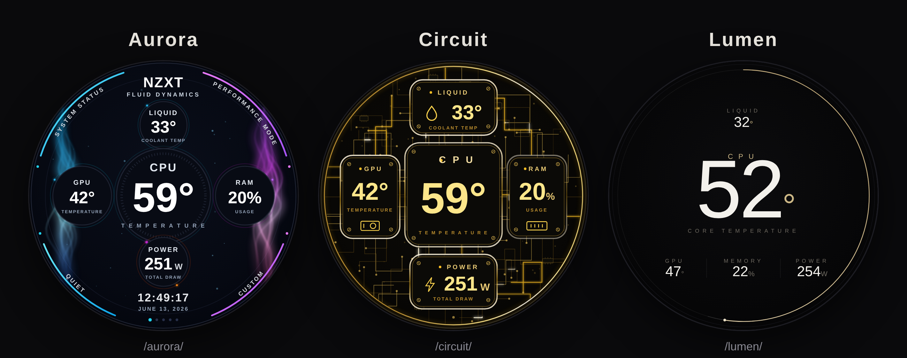

# NZXT Kraken Elite — Custom Web Integrations

Custom dashboard faces for the **NZXT Kraken Elite** LCD (640×640 round display),
built as [NZXT CAM Web Integrations](https://developer.nzxt.com/). Each face shows
live CPU / GPU / liquid temperatures, RAM usage and estimated power draw, fed by
`window.nzxt.v1.onMonitoringDataUpdate`. Pure HTML/CSS/SVG + a little JavaScript —
no build step, no dependencies.



## Faces

| Face | Style | Live URL | Try it in CAM |
| :--- | :--- | :--- | :--- |
| **Fluid Dynamics** | Purple circular dials (the original) | https://najibra.github.io/nzxtv2/ | [NZXT CAM](https://cam-redirect.nzxt.com/action/load-web-integration?url=https://najibra.github.io/nzxtv2/) · [Beta](https://cam-beta-redirect.nzxt.com/action/load-web-integration?url=https://najibra.github.io/nzxtv2/) |
| **Aurora** | Cyan/magenta energy beams down the sides | https://najibra.github.io/nzxtv2/aurora/ | [NZXT CAM](https://cam-redirect.nzxt.com/action/load-web-integration?url=https://najibra.github.io/nzxtv2/aurora/) · [Beta](https://cam-beta-redirect.nzxt.com/action/load-web-integration?url=https://najibra.github.io/nzxtv2/aurora/) |
| **Circuit** | Gold PCB with electric sparks running the traces | https://najibra.github.io/nzxtv2/circuit/ | [NZXT CAM](https://cam-redirect.nzxt.com/action/load-web-integration?url=https://najibra.github.io/nzxtv2/circuit/) · [Beta](https://cam-beta-redirect.nzxt.com/action/load-web-integration?url=https://najibra.github.io/nzxtv2/circuit/) |
| **Lumen** | Minimal luxury — one big number, hairline ring | https://najibra.github.io/nzxtv2/lumen/ | [NZXT CAM](https://cam-redirect.nzxt.com/action/load-web-integration?url=https://najibra.github.io/nzxtv2/lumen/) · [Beta](https://cam-beta-redirect.nzxt.com/action/load-web-integration?url=https://najibra.github.io/nzxtv2/lumen/) |
| **Spectra** | Live rainbow equalizer bars behind the readouts | https://najibra.github.io/nzxtv2/spectra/ | [NZXT CAM](https://cam-redirect.nzxt.com/action/load-web-integration?url=https://najibra.github.io/nzxtv2/spectra/) · [Beta](https://cam-beta-redirect.nzxt.com/action/load-web-integration?url=https://najibra.github.io/nzxtv2/spectra/) |
| **Web Hero** | Comic red/blue web split with mask eyes that blink | https://najibra.github.io/nzxtv2/webhero/ | [NZXT CAM](https://cam-redirect.nzxt.com/action/load-web-integration?url=https://najibra.github.io/nzxtv2/webhero/) · [Beta](https://cam-beta-redirect.nzxt.com/action/load-web-integration?url=https://najibra.github.io/nzxtv2/webhero/) |
| **Porcelain** | Soft neumorphic white panels with pastel arcs | https://najibra.github.io/nzxtv2/porcelain/ | [NZXT CAM](https://cam-redirect.nzxt.com/action/load-web-integration?url=https://najibra.github.io/nzxtv2/porcelain/) · [Beta](https://cam-beta-redirect.nzxt.com/action/load-web-integration?url=https://najibra.github.io/nzxtv2/porcelain/) |

## Installation

1. Open **NZXT CAM** with Web Integrations enabled.
2. Go to your **Kraken Elite → LCD Display → Web Integration**.
3. Paste one of the **Live URL**s above (or click a **Try it in CAM** link from a
   browser on the same PC).
4. The face fills the round LCD and updates with your live system data.

Each page also works in a normal browser: it shows a configuration card with a
shareable `nzxt-cam://` link and a live preview running on simulated data.

## How it works

- CAM loads the page with `?kraken=1` and calls
  `window.nzxt.v1.onMonitoringDataUpdate(data)` on every telemetry tick.
- Each face maps that data to its readouts and animates with `requestAnimationFrame`.
- The layout is a `640×640` SVG (`viewBox="0 0 640 640"`) so it scales cleanly to
  the round LCD.

**Telemetry notes:** CAM exposes CPU/GPU temperature & load, liquid temperature and
RAM usage. It does **not** reliably send pump/fan RPM or total system power to web
integrations, so power is estimated from CPU + GPU package power (or their load when
package power isn't reported), and pump/fan readouts are omitted.

## Development

No tooling required — it's static files. To preview locally:

```bash
python3 -m http.server 8765
# then open http://localhost:8765/aurora/index.html
```

Each face lives in its own folder (`aurora/`, `circuit/`, `lumen/`, …) with
`index.html`, `styles.css` and `script.js`. The root is the original Fluid Dynamics
face.

## License

Free to use and modify. Maintained by [@Najibra](https://github.com/Najibra).
